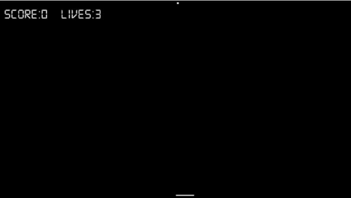

# Pong game
This game was developed using the SFML library.

# Setting up the environment
1. Install Visual studio
1. Add the files to the current directory

# Set up the code
1. Execute the Timber.CPP file to play the game
